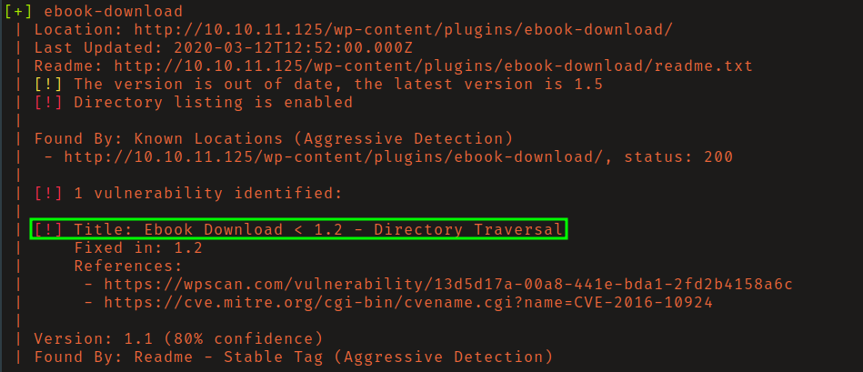
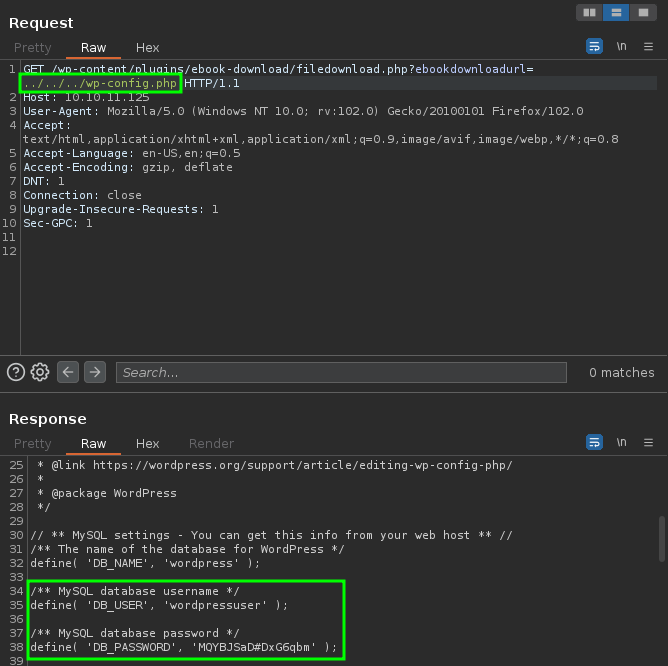
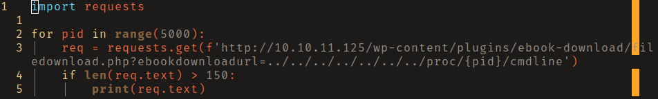
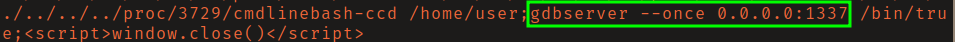
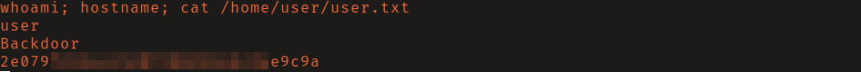
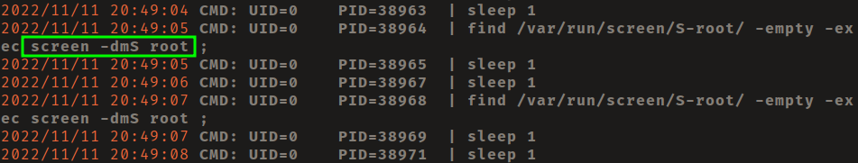
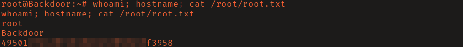

# HTB: Backdoor

## Reconnaissance

While scanning for open ports you will find on port 80 a wordpress site, and an
unknown service on port 1337. 

Using `wpscan` with aggressive plugin detection mode enabled you will find that
a version of the ebook-download plugin is installed and has a local file 
inclusion (LFI) vulnerability (CVE-2016-10924).

Abusing the LFI at
`/wp-content/plugins/ebook-download/filedownload.php?ebookdownload=../../../wp-config.php`
you are able to read plain-text credentials for the MySQL server. Attempts with 
to log in with known usernames, found by abusing the LFI to
read `/etc/passwd`, failed.

 

In an attempt to identify what is running on port 1337, you can abuse the LFI to
brute force process ids (PID) of running processes by accessing
`/proc/<PID>/cmdline`. I did this by writing a quick-and-dirty python script as
seen below. However, this could be accomplished with a fuzzing tool such as
`ffuff` but you will have to generate a wordlist that contains the numbers 
1-5000. 

Output of my python script isn't pretty but it was able to identify gdbserver as 
the process running on port 1337.

## Initial Access 

Gdbserver allows you to remotely use the gdb debugger. Since debuggers can run
programs, we can upload a malicious binary to the server, run it, and catch a
reverse shell as seen below. This will grant you low-privilege command execution
on the server. 

## Privilege Escalation

Running `pspy32` you will notice a command executing `screen` as root. When a
process is started with `screen` it can be detached from the session and then
reattached at a later time.

Researching how to use screen as a privilege escalation vector I came across a 
[blog post](https://steflan-security.com/linux-privilege-escalation-exploiting-shell-sessions/)
by Stefano Lanaro. To escalate privileges:
- set the terminal environment variable with `export TERM=<YOUR TERM>`
- run `screen -x root/root`

