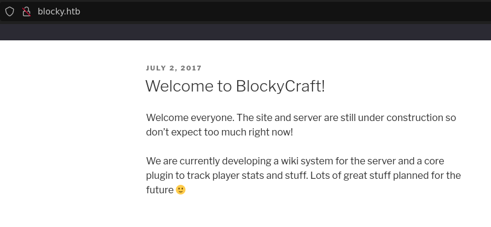
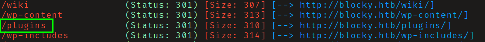
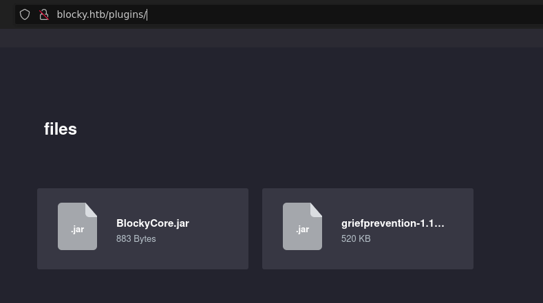
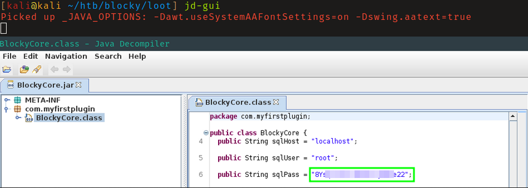
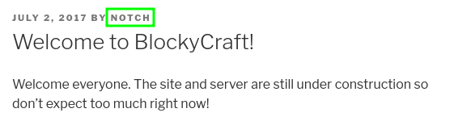
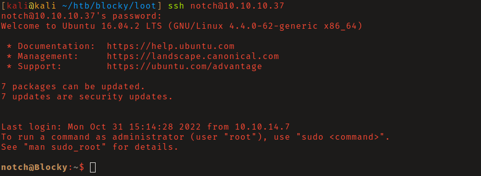
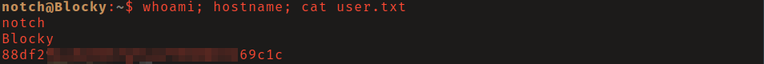
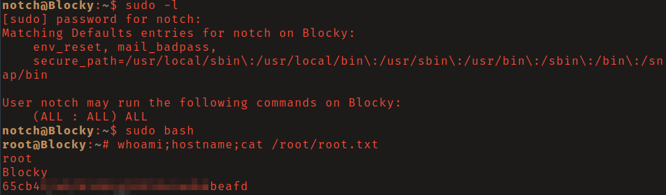

# HTB: Blocky

## Reconaissance

The web server redirects to `blocky.htb`. Add this to your `/etc/hosts/` file 
and navigate to `http://blocky.htb` to find a wordpress site.

Using gobuster to bruteforce directories `/plugins/` was found. This directory
contained 2 `.jar` files which could be downloaded.

Jar files can be decompiled using `jd-gui` which can be installed using `apt`. A
password for the root sql user was found in `BlockyCore.jar`. 

## Initial Access

I was unable to log in via ssh as root with this password. However, I was able
to log in as the user _notch_ with these credentials who's username I found on 
a blog post on the site. 

## Privilege Escalation

User _notch_ was able to run any commands with sudo. I abused this to spawn a
shell as root.

