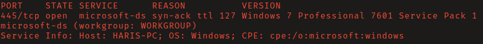
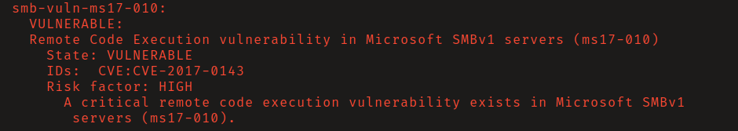
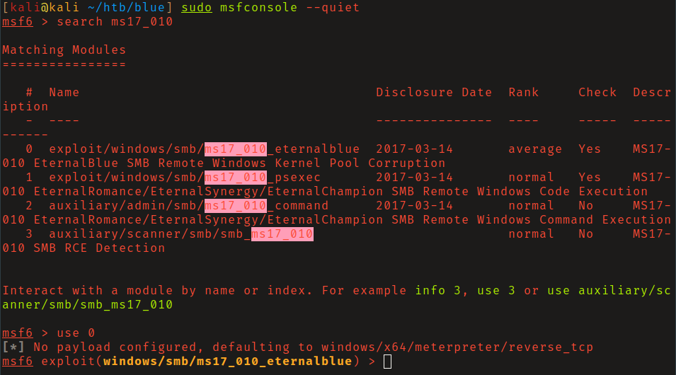
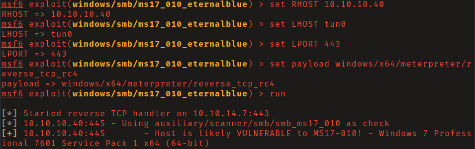
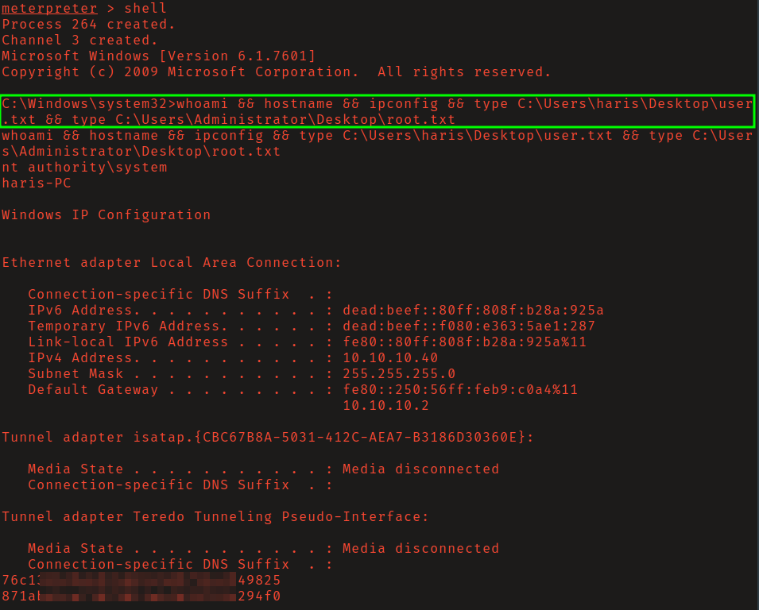

[#](#) HTB: Blue 

As the name implies, this system was found to be vulnerable to CVE-2017-0144 aka
"Eternal Blue" (MS17-010). This is a severe vulnerability that affected several 
versions of the Windows OS that allows for remote code execution if an attacker 
sends specially crafted messages to an SMBv1 server. 

This vulnerability was patched by Microsoft in March 2017. Microsoft also
automatically disabled SMBv1 on the latest versions of Windows 10 and Servers
2012/2016. An additional emergency patch for _unsupported_ operating systems 
such as XP, Windows 8, and Server 2003, was also released.

## Reconnaissance

Nmap detected that the operating system version running on the machine was
Windows 7 SP1. 

The Nmap nse script `smb-vuln-ms17-010` found that the machine was vulnerable to
Eternal Blue. 

## Intial Access

Start MetaSploit. Search for, and load, the `ms17_010_eternalblue` module.

Set the appropriate options as seen below and run the exploit. Here I am 
experimenting with the `reverse_tcp_rc4` meterpreter payload so that the network 
traffic for my reverse shell is encrypted. 

After approximately 3 minutes the exploit finished and remote code execution as 
`NT AUTHORITY\SYSTEM` was achieved.

