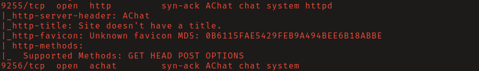

# HTB: Chatterbox

## Reconnaissance

A scan of all tcp ports will find that the service _Achat_ is running on ports
9255 and 9256. 

## Initial Access

A buffer overflow vulnerability is present in some versions of Achat. Searching
exploit-db I found [this exploit](https://www.exploit-db.com/exploits/36025).
In the comments of the source code you will a template for msfvenom to generate
your own shellcode. 

Generate shellcode using the `windows/shell_reverse_tcp` non-staged payload. 

Replace the shellcode in the exploit with the output of msfvenom and modify the
`server_address` variable to point to the victim machine.

Start a netcat listener and run exploit using `python2`. You should now have an
interactive shell as the user _alfred_. 

## Privilege Escalation

There is a few options you can take here. Alfred's credentials are stored in
plaintext in the registry key `HKLM\SOFTWARE\Microsoft\Windows
NT\CurrentVersion\WinLogon`, and this password is _reused for the Admin user._
You could potentially login as Administrator with PsExec, but not without
forwarding port 139, as it is not exposed externally. However, `root.txt` is
owned by our current user, and you could just grant yourself access to it to
read the contents. As seen below. 

