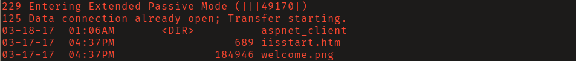
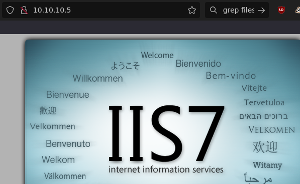
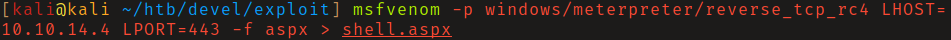
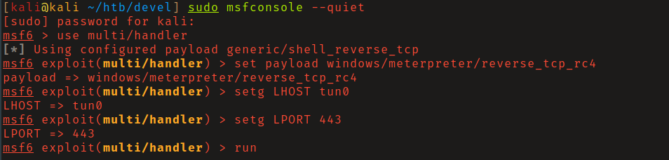
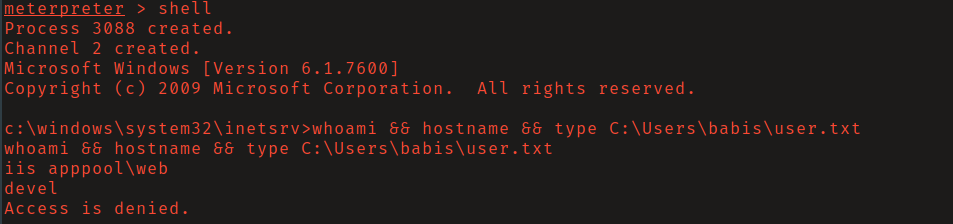
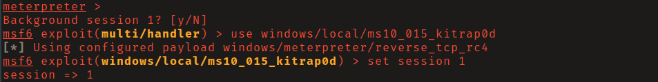
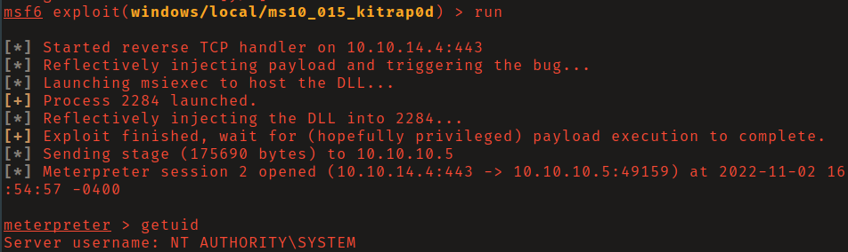
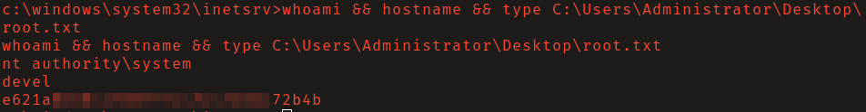

# HTB: Devel

## Reconnaissance

FTP server allowed for anonymous login and unrestricted file uploads via the
`put` command. The root of the ftp server was the root directory for the IIS web
server running on port 80.

## Initial Access

Generate a meterpreter payload with `msfvenom`, start a MetaSploit
`multi\handler` listener, upload payload via ftp, and then navigate to the file
on the web server with your browser to trigger payload. This will grant you a
shell as the low-privileged user _iis apppool\web_. 

## Privilege Escalation

Metasploit's exploit suggester module found that the system was vulnerable to
[MS10-015](https://learn.microsoft.com/en-us/security-updates/SecurityBulletins/2010/ms10-015)
([CVE-2010-0232](https://www.cve.org/CVERecord?id=CVE-2010-0232)). 
This exploits a now patched vulnerability in the Windows kernel. 

Background the current session and load the module
`windows/local/ms10_015_kitrap0d`, set the session and other options as needed,
and run to gain shell as _NT Authority/SYSTEM_.

