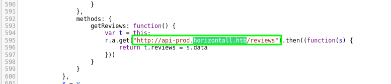
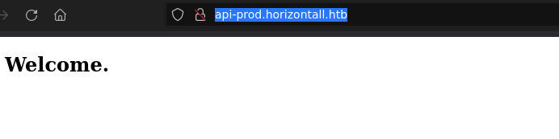
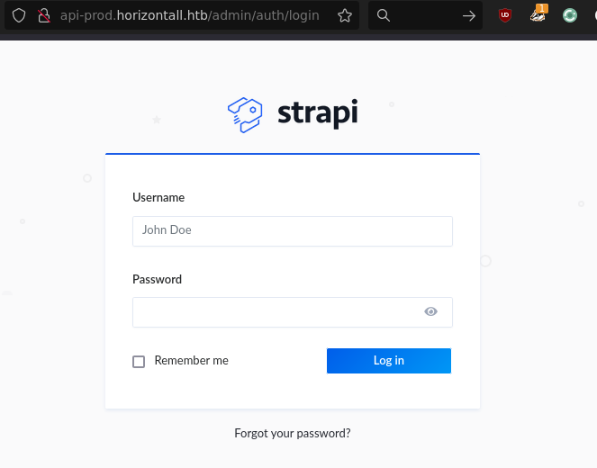
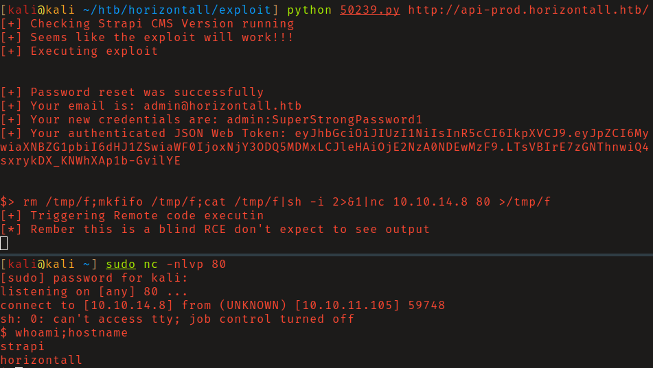
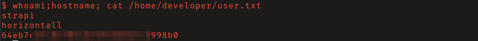
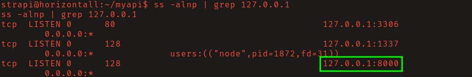
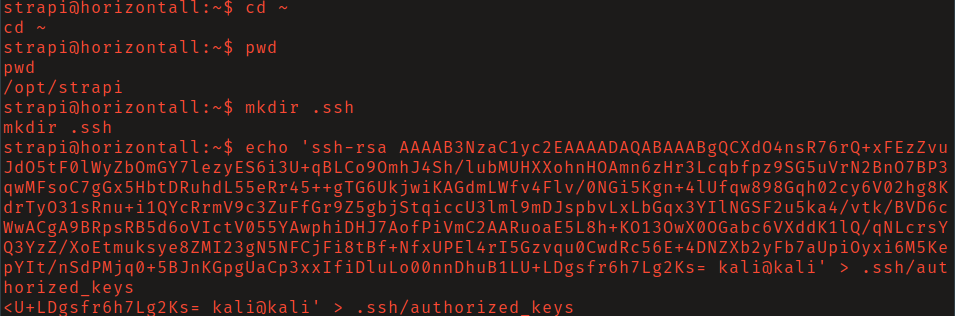
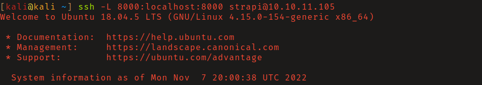
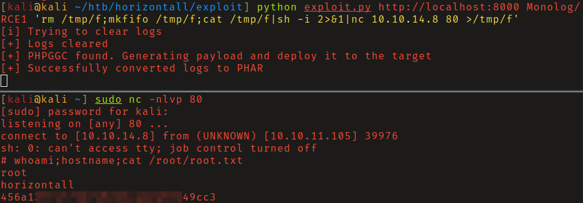

# HTB: Horizontall

## Reconnaissance

HTTP server on port 80 redirects to `horizontall.htb`. Add this to your
`/etc/hosts` file. 

Viewing the source code of the javscript files on the server you will find the 
virtual host `api-prod` in `/js/app.c68eb462.js`. Add `api-prod.horizontall.htb` 
to your hosts file.

Run gobuster on this vhost to find `/admin/` which takes you to a login page for 
_strapi_. 

## Initial Access

Searching exploit-db for strapi I found `50239.py` which is an unauthenticated
remote code execution exploit (CVE-2019-18818, CVE-2019-19609).

Review the exploit source code and run it. This will allow you to blindly run
commands on the server. Start a netcat listener and use a reverse shell command 
to get an interactive shell as the user _strapi_. 

## Privilege Escalation

Checking for listening ports that were not detected with our intial scan you
will find that port 8000. Using curl to access this port locally you will see
that it is running Laravel v8. 

Searching for vulnerabilities in Laravel you will find cve-2021-3129. I found
this [exploit](https://github.com/nth347/CVE-2021-3129_exploit)  by nth347 on 
github. I first attempted to run it on the victim machine locally without
success the exploit requires internet access, which HTB machines do not have.

Create a `.ssh` directory in strapi's home folder, and create an 
`authorized_keys` within that directory containing the contents of your
`id_rsa.pub`. You should now be able to log in as strapi via ssh without a
password.

Next use ssh to establish a reverse port forward for port 8000. Confirm that you
can access the Laravel server by navigating to `http://localhost:8000`.

Run the above
exploit from your attacking machine, directing it to the forwarded port on your
localhost, with reverse shell payload as your command. Be sure to start a
listener beforehand. You should now have a shell as _root_.

