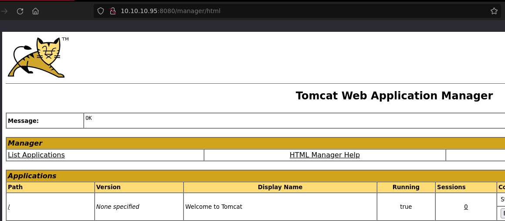

# HTB: Jerry

## Reconnaissance

Nmap scan found that a Tomcat instance was running on port 8080. 

## Initial Access

Default credentials (tomcat:s3cret) were used to log in to the management panel. 

Craft a malicious WAR file with msfvenom and upload it to "WAR file to deploy."

Start netcat listener, navigate to the directory path named after 
uploaded malicious WAR file, and receive connection back from payload. 

No escalation of privileges required as payload was executed as _NT
Authority\SYSTEM._

