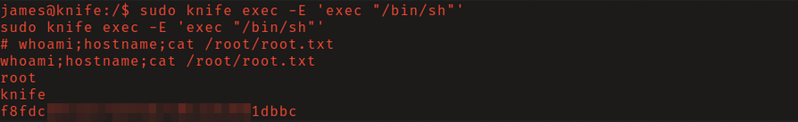

# HTB: Knife

Apache server on this machine was running a vulnerable version of PHP which
allowed for remote command execution. Privileges were then escalated via a
misconfigured sudo permission. 

## Reconnaissance

Nmap scan found that Apache server running on port 80 had PHP version 8.1.0-dev
installed. Researching this version I found that a threat actor had pushed 2
malicious commits to the PHP source code which contained a backdoor. 
Reference this 
[blog post](https://flast101.github.io/php-8.1.0-dev-backdoor-rce/)
by [flast101](https://github.com/flast101) for further detail.

## Initial Access

Searching exploit-db for this version of PHP I found `php/webapps/4933.py`.
After inspection of the [source code](https://www.exploit-db.com/exploits/49933)
found nothing suspicious, I ran it, aquiring non-interactive command execution 
as the user "james."

To gain an interactive shell I utilized a "nc mkfifo" reverse shell, caught it 
with a netcat listener, and stabilized it with python.

## Privilege Escalation

Executing `sudo -l` I found that this user could run the `knife` binary with 
sudo - without a password. Searching [GTFOBins](https://gtfobins.github.io/) 
I found a viable method to abuse this binary to escalate privileges as seen
below.

