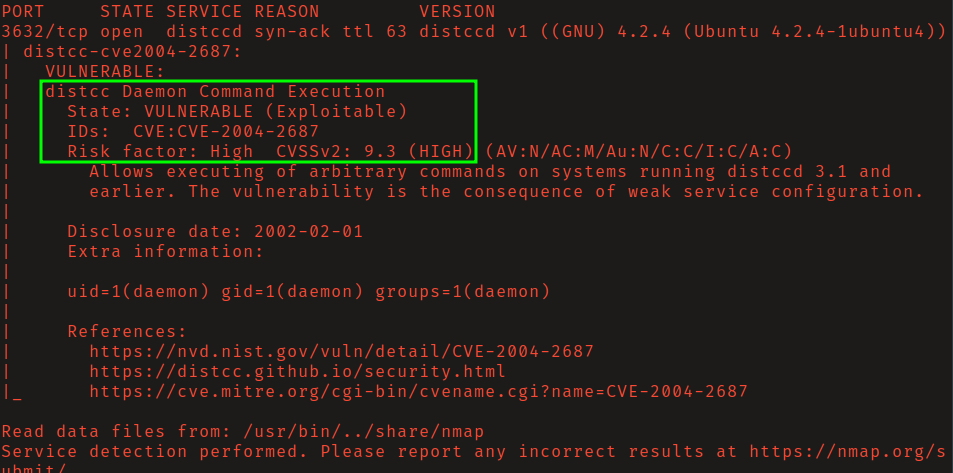
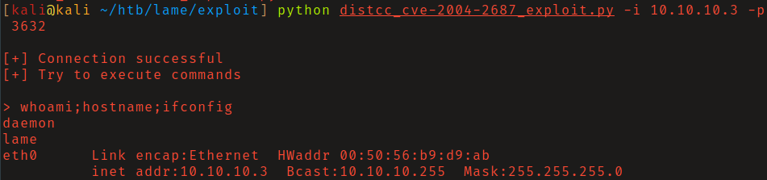
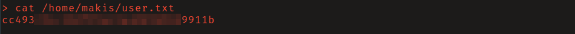
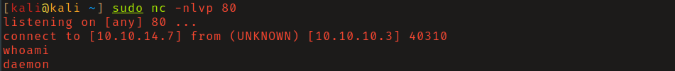
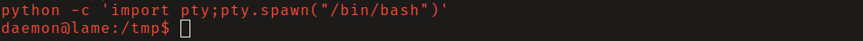
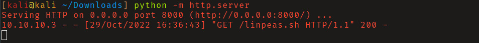
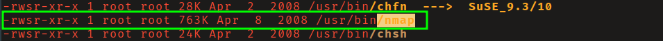
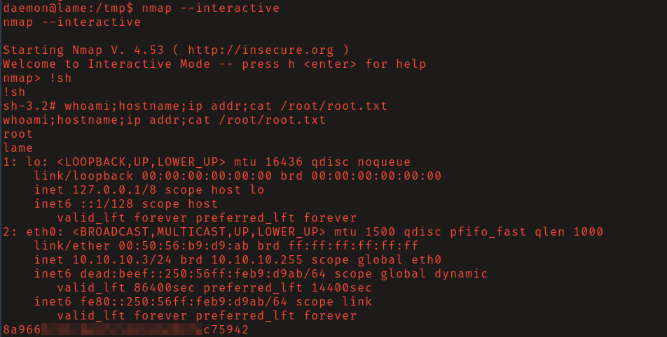

# HTB: Lame

## Reconnaissance

Nmap scan found that tcp port 3622 is open and running the distcc. 
Distcc is a tool for speeding up compilation of source code by using distributed
computing over a computer network. With the right configuration, distcc can
dramatically reduce a project's compilation time.

Nmap nse script _distcc-cve2004-2687_ found that the version of the service
running on the system is vulnerable to 
[CVE-2004-2637](https://nvd.nist.gov/vuln/detail/CVE-2004-2687).

This vulnerability allows remote attackers to execute arbitrary commands via 
compilation jobs, which are executed by the server without authorization checks.

## Initial Access

Searching for public exploits for this vulnerability I found 
[this one](https://raw.githubusercontent.com/angelpimentell/distcc_cve_2004-2687_exploit/main/distcc_cve-2004-2687_exploit.py)
by Github user angelpimentell. After reviewing the source code and finding
nothing suspicious, I ran it, and achieved remote command execution as the user
"daemon." As seen below. 

## Privilege Escalation

I then transitioned from the non-interactive shell of the exploit to an
interactive one and stabilized it with python. 

Using python's http server module I hosted 
[linpeas.sh](https://github.com/carlospolop/PEASS-ng/releases) on my host system
and executed it on the victim machine without saving the file by using curl and 
piping the output into bash. I found nmap was installed and had the SUID bit
set. 

You can obtain a shell with nmap using the `--interactive` flag and then running
`!sh`. With the SUID set the binary will be ran with the privileges of it's
owner, which in this case is root.

