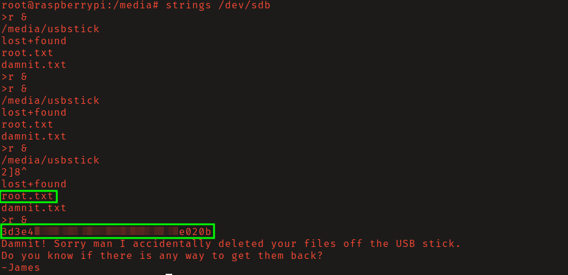

# HTB: Mirai

## Reconnaissance

HTTP header reveals that server is running Pi Hole, a DNS level ad-blocking
service usually run on Raspberry Pi hardware.

## Initial Access

Successfully logged in via ssh with the known Raspberry Pi default credentials
`pi:raspberry`. 

## Privilege Escalation

User _pi_ was able to execute all commands without a password as _root_ which
allowed for easy privilege esacalation. However, a note left it `root.txt`
stated that the flag was lost and located on a USB stick.

## Recovering Root Flag

Found that the drive was mounted at `/media/usbstick/`. Listing it's contents 
I discovered another note, this one stating that the flag had been accidentally 
deleted. 

Located the drive device name using the `mount` command. Ran `strings` on the
device to recover the flag. This was possible because data on a drive, unless
using secure deletion method, is not automatically overwritten when deleted, and
will remain on the drive until that location on the drive is overwritten by new
data. 

