# HTB: Netmon

Anonymous access to an FTP server allowed for exfiltration of a backup of a 
configuration file for the PRTG Network Monitor service running on port 80 which
contained plaintext credentials that allowed for guessing of a valid set of 
credentials to log on to the PRTG service.  

Once logged on, you are able to execute programs by configuring and triggering a
notification. Which in this case entailed adding a new user, adding them to the
local administrators group, and logging in to the server via winrm. 

## Reconnaissance

FTP server allowed for anonymous login. It's root directory was the `C:\` drive. 

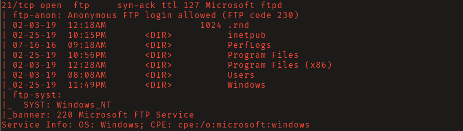

On port 80 PRTG Network Monitor was running. 

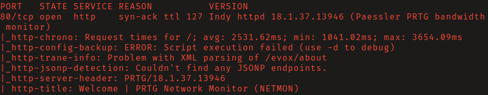

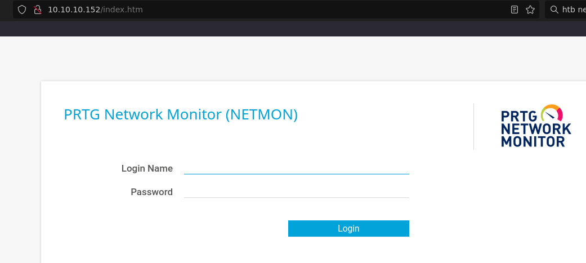

I attempted to log in with the application's default credentials 
`prtgadmin:prtgadmin` without sucess.

I found a [security
advisory](https://www.paessler.com/about-prtg-17-4-35-through-18-1-37)
stating that this version of PRTG stores user account passwords and some other 
account passwords, in plain-text, to a configuration .dat file. 

With anonymous access to the ftp service I was able to navigate to
`C:/ProgramData/Paessler/PRTG Network Monitor` where 3 interesting files were
located.  

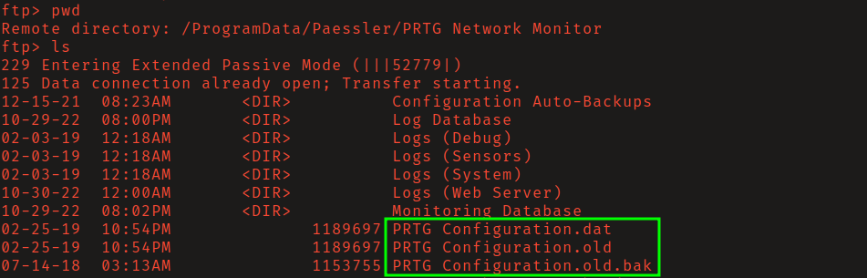

I downloaded the files and upon inspection I found the credentials 
`PrTg@dmin2018` located in `PRTG Configuration.old.bak`. 

Attempting to login to the PRTG admin panel with these credentials failed.
However, I tried `PrTg@dmin2019` and was able to login. 

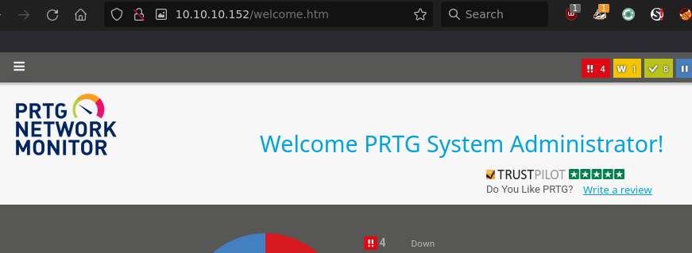

## Initial Access

Navigate to Setup > Account Settings > Notifications and select "Add new
notification." Then scroll down and select "Execute a program." 

First confirm command execution by successfully pinging your local host. 

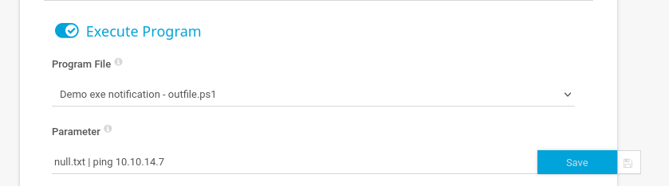

Start tcpdump to listen for ICMP packets. Trigger the notification by 
clicking the edit button and then the bell as seen below.

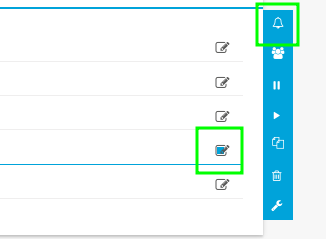

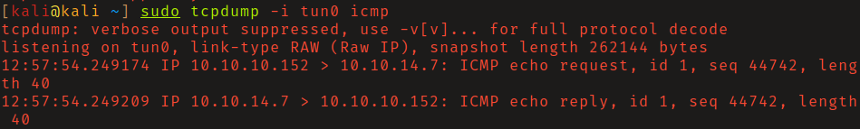

The command below will add the user "rusty" with a password of "passwd123!" and 
add this user to the local administrators group. 

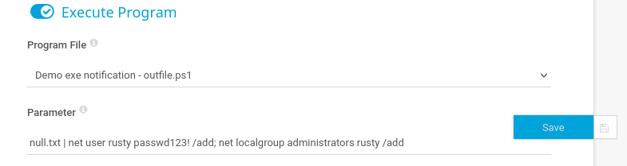

Run this notification, then log in as the newly created administrator user 
using `evil-winrm`. 

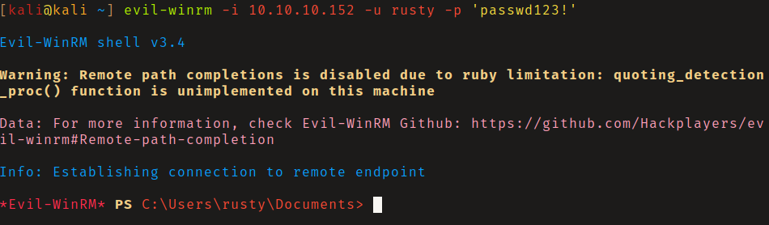

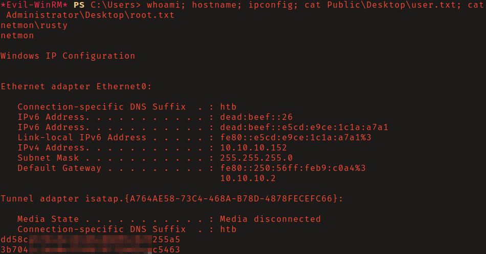
