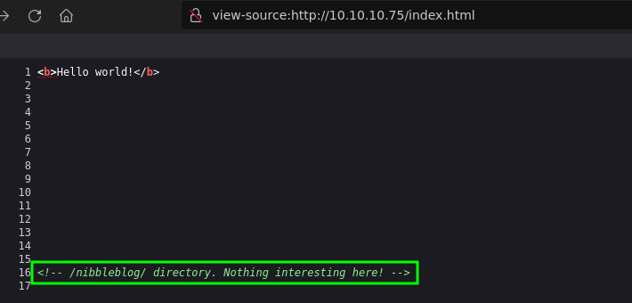
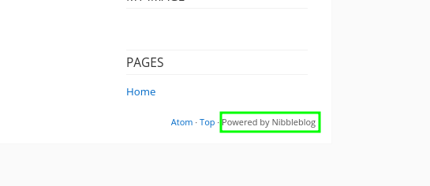
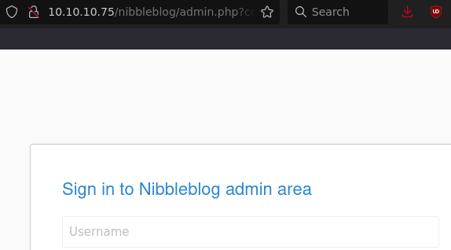
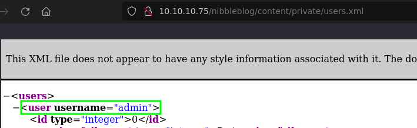
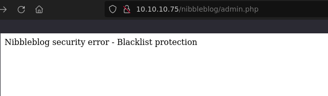
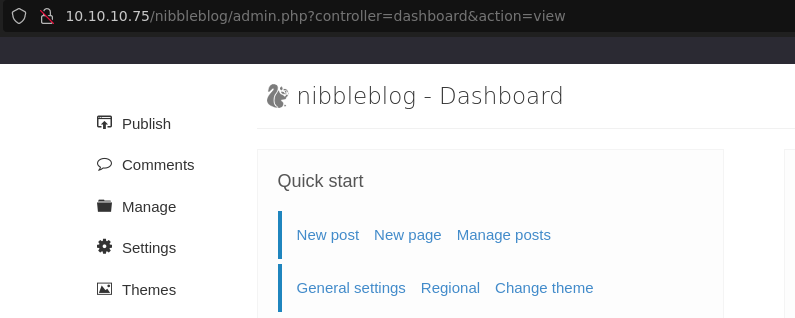
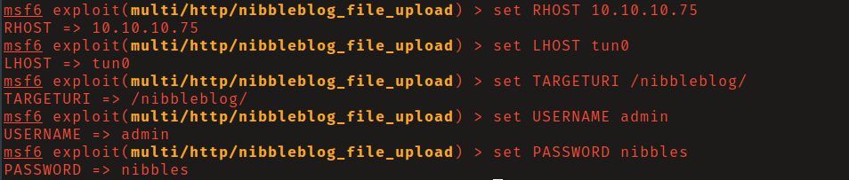
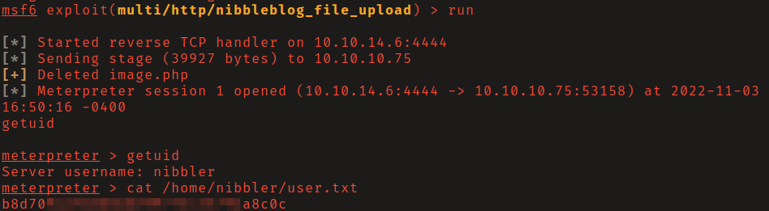
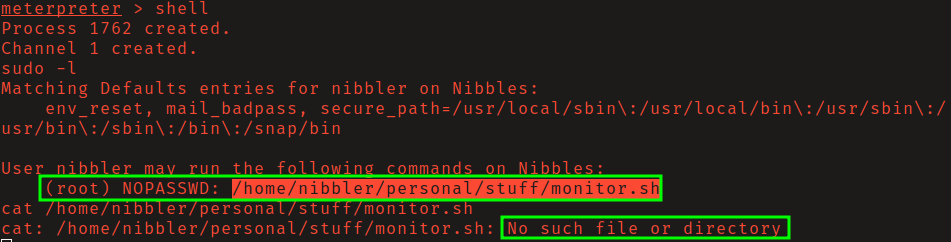

# HTB: Nibbles

## Reconnaissance

A comment in the source code of the http server's landing page mentions
`/nibbleblog/`. Navigating to that directory you find an instance of
_NibbleBlog_ running. 

While bruteforcing for files and directories within `/nibbleblog/`, the 
administration login was found as well as an xml file, that contains the
username `admin`. 

## Initial Access

Too many failed login attempts while guessing passwords leads to getting
temporarily blacklisted. 

After guessing several passwords for the admin user I successfully logged in
with password `nibbles`. 

Searching exploit-db I found the MetaSploit module
`multi/htp/nibbleblog_file_upload`. Load the module and set the options using 
our known valid credentials. Then run to obtain a shell as user _nibbler_.

## Privilege Escalation

Running `sudo -l` you will find that user nibbler can run a script in located in
their home folder without a password as root, and that this script does not 
currently exist. 

Add the directories required to match the script's full path seen in the `sudo
-l` output. Create the script with contents `bash -i`. Add executable
permissions and run to get shell as root.

