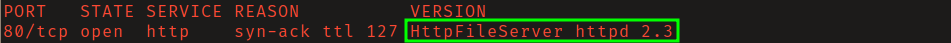
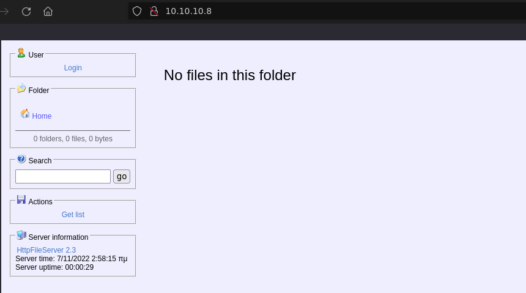
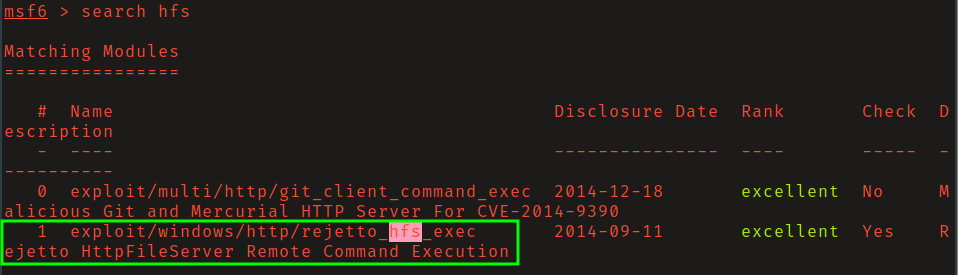
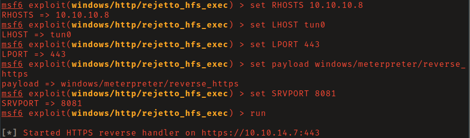
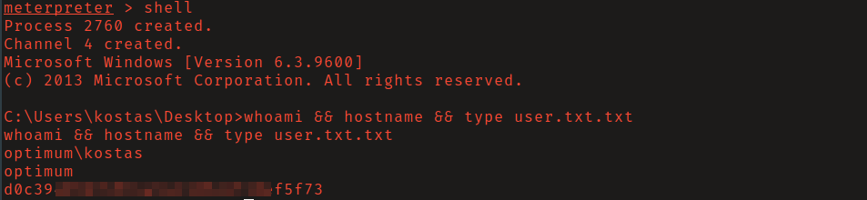
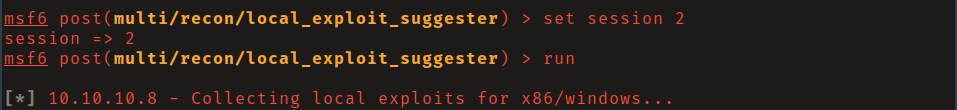
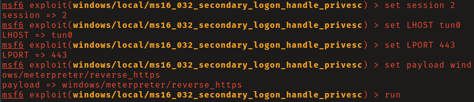
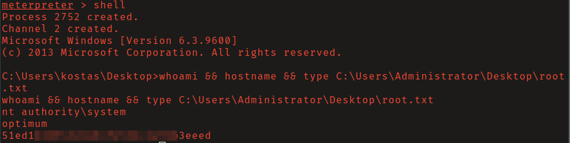

# HTB: Optimum

## Reconnaissance

Vulnerable version of Rejetto HFS http server running on port 80. 

## Initial Access

Searching for a public exploit I found
[this](https://www.exploit-db.com/exploits/39161) on exploit-db which did not
work. I did find MetaSploit module `exploit/windows/http/rejetto_hfs_exec`. 

Load the module, set the required options, and run. Here I am using a reverse 
https payload so that the shell traffic is encrypted using a non-suspicious
port/protocol. 

## Privilege Escalation

Background the meterpreter session. Load the module
`multi/recon/local_exploit_suggester`, set the session option, and run.

It found that the system may be vulnerable to MS16-032 (CVE-2016-099), a
vulnerability in the _Secondary Logon_ service. 

Load the module, set the appropriate options, and run to get shell as NT
Authority\System.

