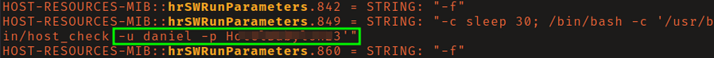
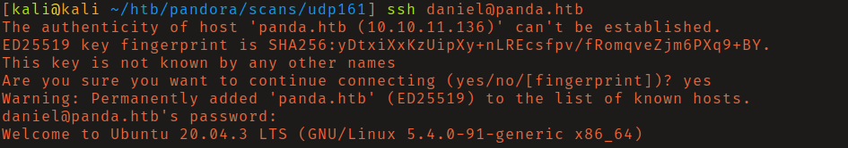

# HTB: Pandora

## Reconnaissance

At first glance it seems like there isn't much to be found. However, running a
UDP scan you will find that port 161 (snmp) is open. Running snmpwalk and
parsing the output you will find a set of credentials for the user daniel. 

## Initial Access

You can log in with the found credentials via ssh. 

## Privilege Escalation

Running linpeas found that the box was vulnerable to CVE-2021-4034 (PwnKit). I 
used this [exploit](https://github.com/ly4k/PwnKit) to escalate privileges to 
root. 

