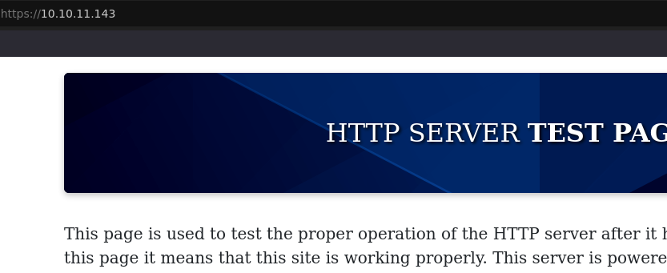
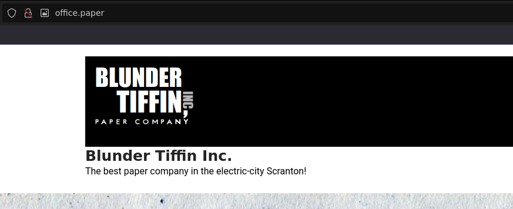
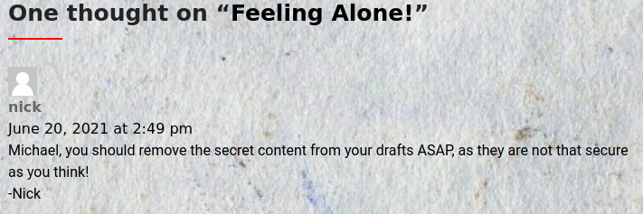
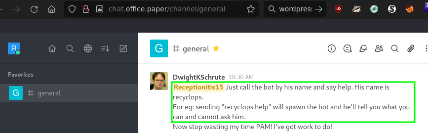
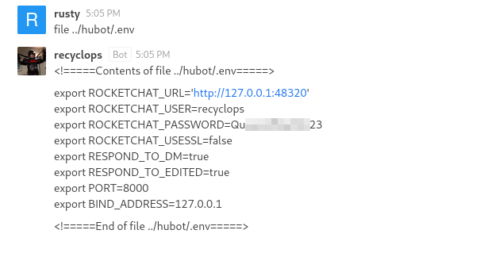
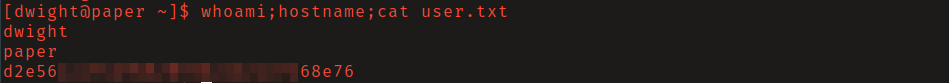
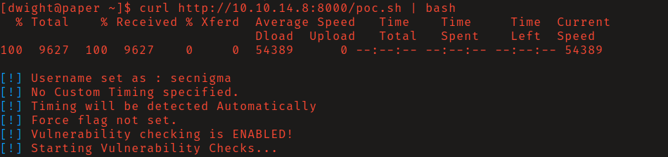
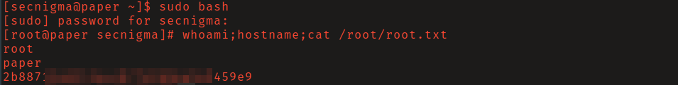

# HTB: Paper

## Reconnaissance

The landing page reveals nothing of interest. Neither did brute-forcing for 
files and directories.

However, HTTP response header `X-Backend-Server` leaks `office.paper`. Add this 
domain to your `/etc/hosts` file. Accessing the http server _on port 80_ now 
takes us to a wordpress site.

A comment on a blog post mentions that secret content from draft posts is
accessible. Checking for vulnerabilities in this version of wordpress I found
one that allows for unauthenticated viewing of private/draft posts by making a
get request to `/?static=1`. 

A registration link to an employee chat system on `chat.office.paper` was found
in the drafts. Register for an account to log in. 

Searching through the messages you will find mentions of a chat bot.

When listing the commands of the bot by sending `recyclops help` to recyclops in
a direct message, two interesting commands can be found: `list` to list files 
and `file` to print file contents. 

## Initial Access

Testing for command injection fails as there is filtering in place, but you are
able to traverse directories using `../`. 

Researching rocket chat and hubot I found that a password for hubot is stored in
plaintext in `hubot/.env`. 

Using this password you are able to log in as the user _dwight_. 

## Privilege Escalation

Sudo version 1.8.29 is installed on the system which is vulnerable to
[CVE-2021-3560](https://nvd.nist.gov/vuln/detail/CVE-2021-3560), which allows
for an unprivileged local attacker to create a new local administrator.
Searching for exploits I found 
[this one by secnigma.](https://raw.githubusercontent.com/secnigma/CVE-2021-3560-Polkit-Privilege-Esclation/main/poc.sh)

After an inspection of the source code, run it. I did this by
hosting the file on my attacking system, and piping the output of `curl` into 
`bash`. 

It may take several tries before it completes successfully. When it does use 
`sudo - secnigma` and enter the password `secnigmaftw`. Once you have a shell as
_secnigma_ run `sudo bash` get a shell as root.

