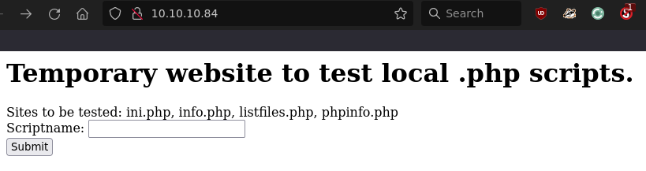
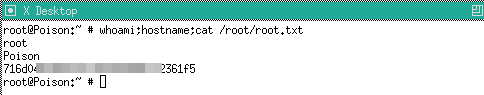

# HTB: Poison

## Reconnaissance

Navigating to the web server running on port 80 you will find a temporary test 
site to "test scripts." You are able to run php scripts located on the server as
well as traverse directories to read files. 

`listfiles.php` contained an interesting file name `pwdbackup.txt`. Which you
are able to read using the sites functionality. This file contained base64
encoded data. 

Decoded the output of `pwdbackup.txt` with cyberchef. Repeatedly decoding base64
until pasword was revealed. I then read the contents of `/etc/passwd` to get
the users with login shells on the system. 

## Initial Access

You are able to log in as user _charix_ with the decoded password.

## Privilege Escalation

Listing the open ports you will find that 2 common vnc ports are listening 
locally. 

In charix's home folder there is a file `secret.zip`. Download it using `scp`
and unzip as seen below. 

Use ssh for local port forwarding. 

Contents of `secret.zip` contained the file `secret`. I was not sure what this
file was but searching the `vncviewer` man page I found a possible use for it.

Use `vncviewer` to log in as root using the secret file.

