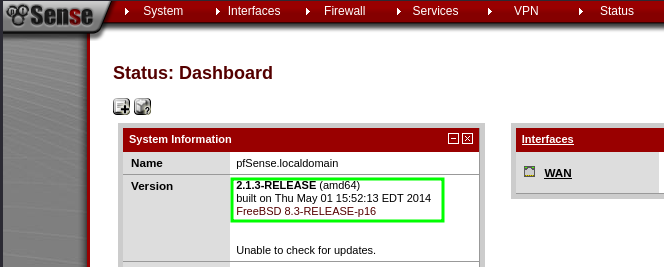
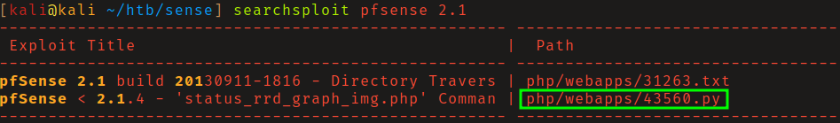

# HTB: Sense

## Reconnaissance

PfSense administration panel running on port 443. PfSense is a firewall/router
distribution based on FreeBSD.

Attempts to log in with default and common credentials failed. 

Fuzzing for files and directories found 2 text files of interest,
`changelog.txt` and `system-users.txt`. 

The importance of trying multiple wordlists presents itself here as 
`system-users` is only present in a few lists. It's my assumption that this
is why this box has a low user rating as you would be unable to move forward
without finding this file.

`changelog.txt` mentions that only _2 of 3 vulnerabilities_ have been patched. 

`system-users.txt` leaked username `Rohit`. You can now log in with 
credentials `rohit:pfsense`, the default password for PfSense. 

## Initial Access

Searching exploit-db for this version of PfSense found the exploit
`php/webapps/43560.py`. After an inspection of  the source code, start a netcat
listener and run the exploit to get a shell as _root_. 

