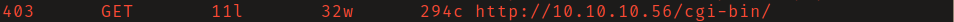
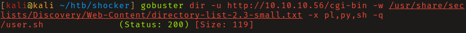
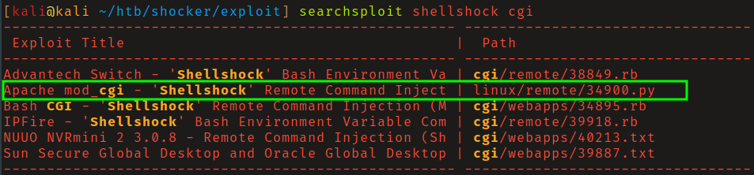
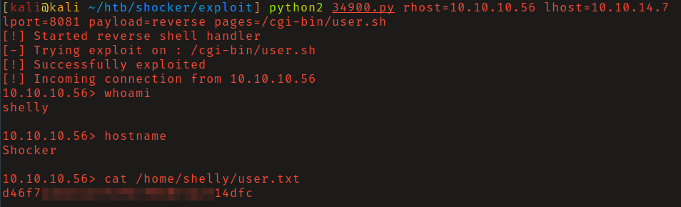
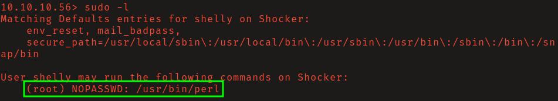
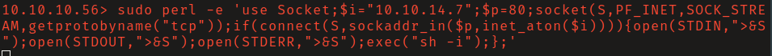
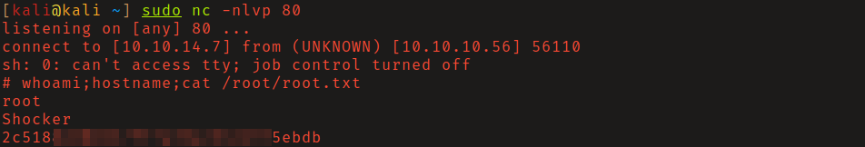

# HTB: Shocker

## Reconnaissance

Directory brute force of the webserver found `/cgi-bin/`. This directory is used
to house scripts that will interact with a web browser to provide additional
functionality. 

Since I was unable to list the contents of this directory, I bruteforced file
names with common script file extensions and found `/cgi-bin/user.sh/`.

## Initial Access

Based on the name of this machine I assumed that a _shellshock_ vulnerability
must be present. Searching exploit-db I found an RCE exploit for Apache mod_cgi,
`linux/remote/34900.py`. 

After a review of the source code found nothing suspicious I ran it obtaining a
non-interactive shell as the user _shelly_. 

## Privilege Escalation

Current user can execute, without a password, `perl` with sudo privileges.

Start a netcat listener on your local host, and execute a perl reverse shell as
sudo to obtain an interactive shell as _root_.

