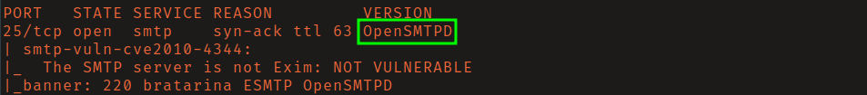
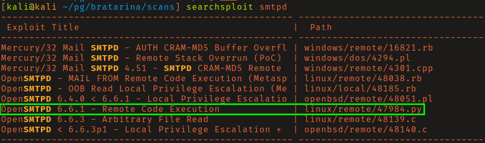
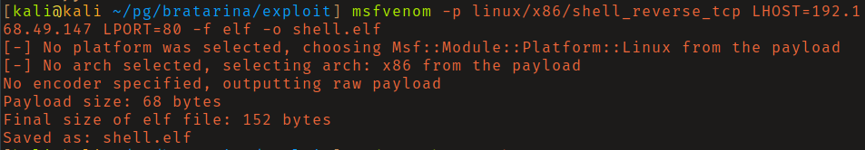
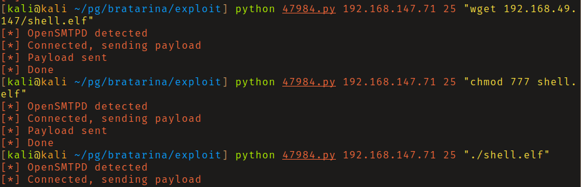
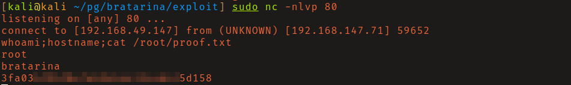

# PG: Bratarina

A few rabbit holes present on this box, but once you identify the attack vector
it's straight forward to exploit. 

## Reconaissance

Nmap scan found that OpenSMTPD service was listening on port 25. Searching
exploit-db I found a remote code execution script for this service. 

## Initial Access

After a review of the exploit's source code, I found that it allows for blind 
command execution. I confirmed this by pinging my attacking box and listening 
for icmp packets with tcpdump. I then tried several reverse shell commands, 
including base64 encoding/decoding them without success. 

I was finally able to get a shell as root by generating an msfvenom payload,
downloading it on the victim machine with wget, and then executing it. 

