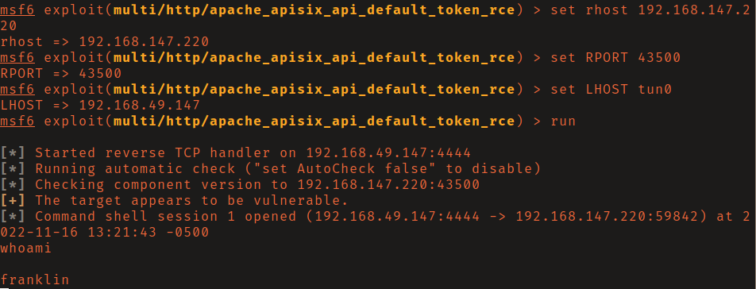

# PG: Flimsy

## Reconnaissance

The response header on the API listening on port 43500 says it's running Apache 
APISix version 2.8. Searching exploit db for this service you will find that it 
has an RCE vulnerability (CVE-2022-24112). 

## Initial Access

Searching on exploit-db I did find a python script. However it
did not work for me. Checking metasploit I found the module
`multi/http/apache_apisix_api_default_token_rce`. 

Set the required options and run it to get a shell as the user franklin. 

## Privilige Escalation

Linpeas found that our current user can write to the `/etc/apt/apt.conf.d`
directory. I then ran `psyspy` which found that a crontab was executing `apt-get
update` every few minutes.

I found this [blog
post](https://laptrinhx.com/linux-for-pentester-apt-privilege-escalation-1256682860/)
which detailed how to escalate privileges in this scenario. This involved
writing a file into the `/etc/apt/apt.conf.d` directory containing directions
for apt to run a reverse shell command and catching it with a netcat listener to
get a shell as root.

