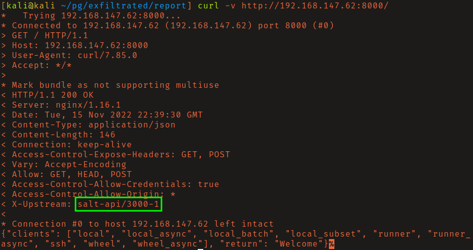
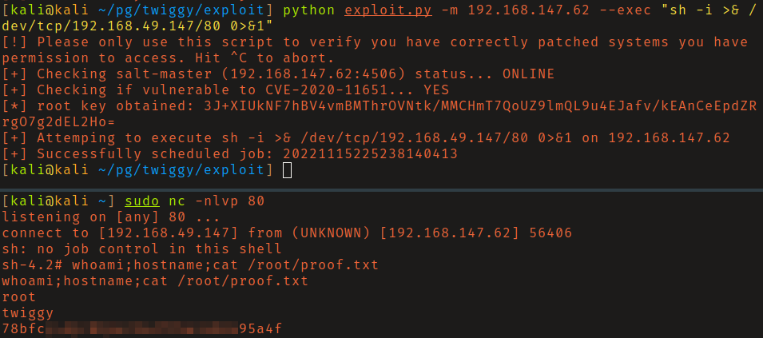

# PG: Twiggy

## Reconnaissance

This one was quite hard to find the attack vector, but an easy box once you do
find it. Looking at the response headers from the API running on port 8000 
you'll see that it's a Salt Framework API. Searching that exact header you will 
find that an authentication bypass vulnerability is present in this version 
(CVE-2020-11651).

## Initial Access

I found this [exploit](https://github.com/jasperla/CVE-2020-11651-poc) on
github. After an inspection of the source code I ran it. Obtaining a shell as
root. 

