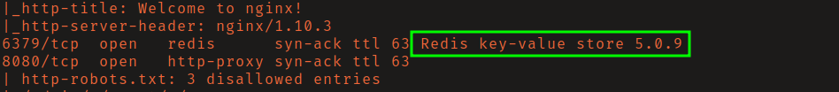
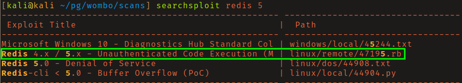
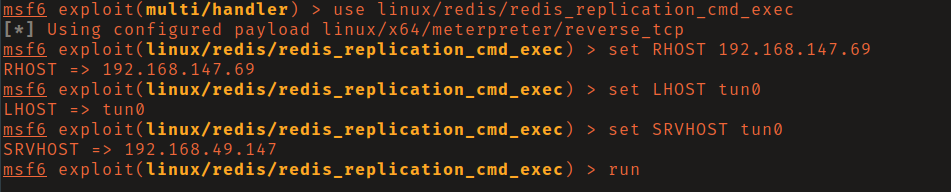
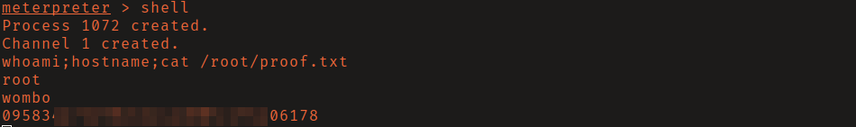

# PG: Wombo

There are a few rabbit holes on this box, but once you find the intended path it
is straight forward to exploit.

## Reconnaissance

An nmap scan of all ports will reveal that Redis version 5.0.9 is running on 
port 6379. Searching exploit-db you will find a metasploit module for this 
version. 

## Initial Access

Load the module `linux/redis_replication_cmd_exec`, set the required options and
run it to get a shell as root. 

