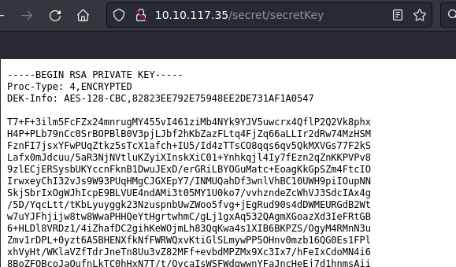
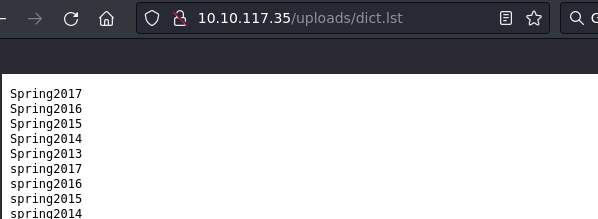
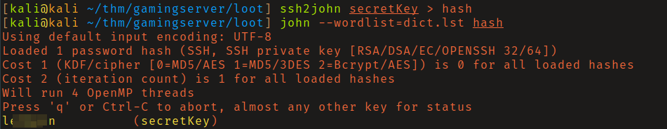
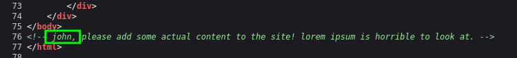
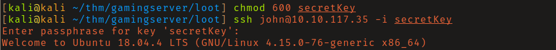
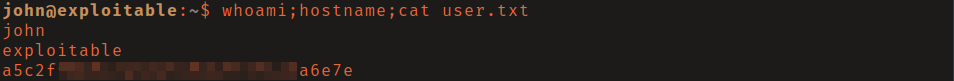
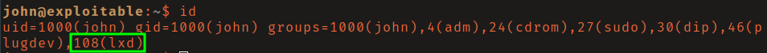
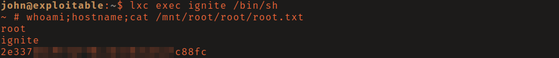

# THM: GamingServer

## Reconnaissance

Brute-forcing files and directories on the web server I found two interesting
files: 

- `/secret/secretKey` - an encrypted RSA key
- `/uploads/dict.lst` - a wordlist

I downloaded these files to my attacking machine using `wget`, used `ssh2john`
to generate a hash of the RSA key, and cracked the password. 

## Initial Access

Inspecting the source code of the web page I found a possible username of "john"
mentioned in a comment. 

I then modified the rsa key permissions and used the key to log in via ssh as 
john.

## Privilege Escalation

John is member of lxd group. I found this
[article](https://www.hackingarticles.in/lxd-privilege-escalation/) which
demonstrates how abuse membership of this group to escalate privileges to root. 

I first built an LXD Alpine Linux image using this
[builder](https://github.com/saghul/lxd-alpine-builder). After following the
steps seen on the tools readme I transferred the `.tar.gz` file to the victim
machine and executed the following commands to get a shell as root:

1. `lxc image import ./alpine-v3.13-x86_64-20210218_0139.tar.gz --alias rusty`
2. `lxc init rusty -c security.privileged=true`
3. `lxc config device add ignite mydevice disk source=/ path=/mnt/root
   recursive=true`
4. `lxc start ignite`
5. `lxc exec /bin/sh`

