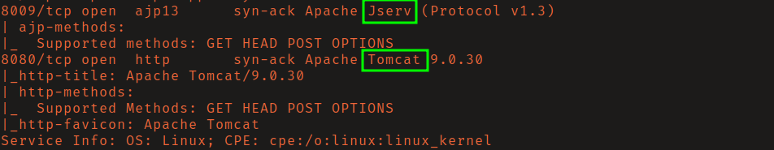
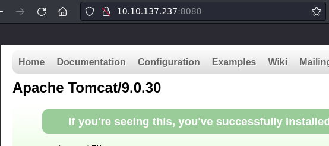
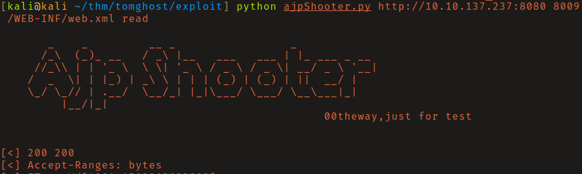
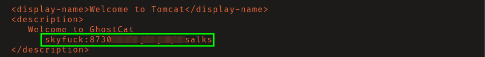
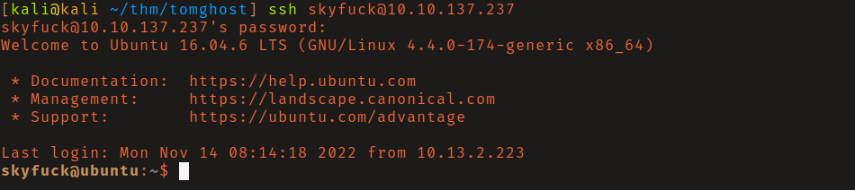
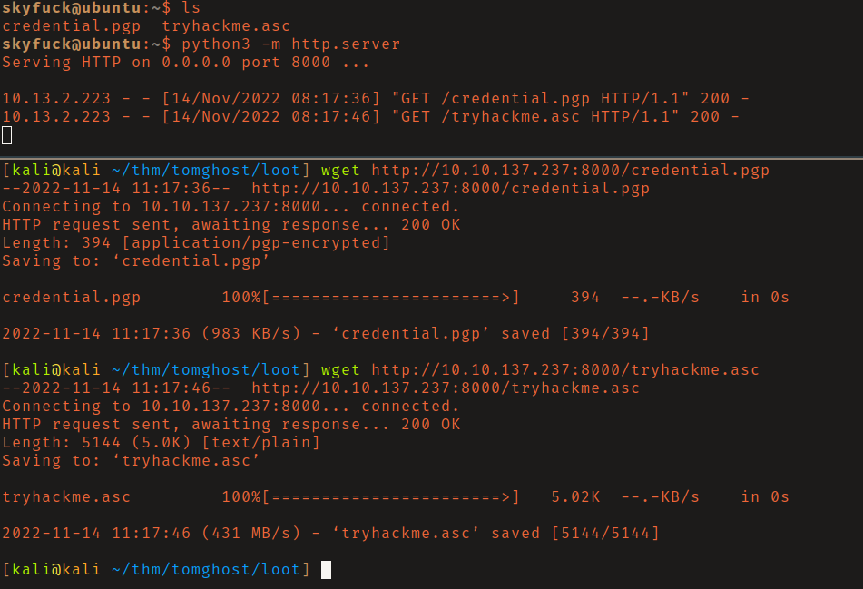
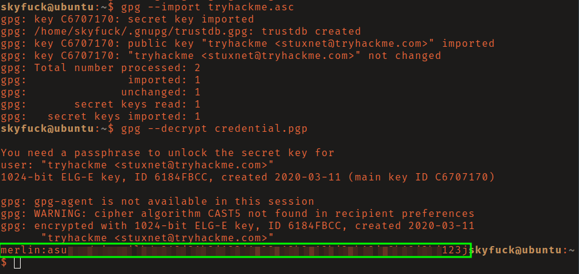
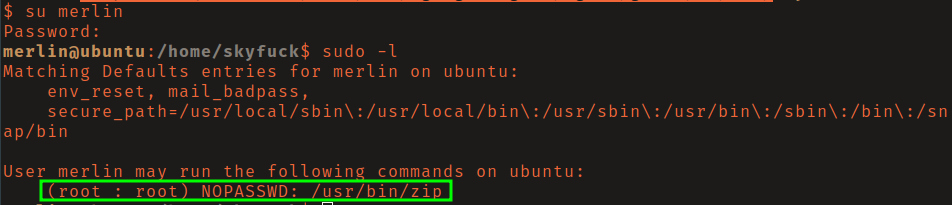
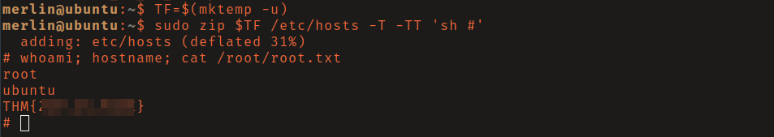

# THM: Tomghost

## Reconnaissance

The ability to log in to Tomcat from remote hosts had been disabled.

Researching port 8009 I found a Local File Inclusion/Read vulnerability known as
Ghostcat (CVE-2020-1938). 

## Initial Access

I found [this](https://github.com/00theway/Ghostcat-CNVD-2020-10487) exploit by
00theway. After a review of the source code I ran it. Reading the 
`/WEB-INF/web.xml` file you can see plaintext credentials for the user
_skyfuck_. 

You are able to log with these credentials via SSH.

However, this user can't read the `user.txt` flag. Listing the contents of their
home directory there is 2 files: `credential.pgp` and `tryhackme.asc`.
Attempting to import the asc key file prompts for a password. After attempts to
use known/common passwords failed, I transferred these files to my attacking 
machine using python's `http.server` module.

I then used `gpg2john` on the asc file to generate a hash and cracked it using
the rockyou wordlist. 

Knowing the password for the gpg key you can now import key and decrypt 
`credential.pgp` to get the password for user _merlin_. You can then use `su` to
get a shell as this user.

[Proof of shell as user merlin](report/screenshots/user_proof2.png)

## Privilege Escalation

Merlin could run `zip` as sudo without a passswd. 

Referencing [GTFOBins](https://gtfobins.github.io/) I found an entry for the
`zip` binary and ran it granting a shell as root.

## Reference

- [Ghostcat is a high-risk file read / include vulnerability in
Tomcat](https://www.chaitin.cn/en/ghostcat)
- [Busting Ghostcat: Analysis of
CVE-2020-1938](https://www.trendmicro.com/en_us/research/20/c/busting-ghostcat-an-analysis-of-the-apache-tomcat-vulnerability-cve-2020-1938-and-cnvd-2020-10487.html)

